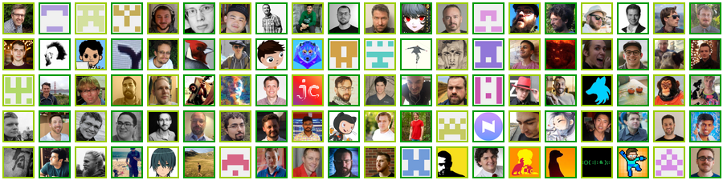

# Examples

A few examples based on some of the awesome projects used by :sparkles: [**stylishc**][stylishc] :sparkles:.

## Sharp
:octocat: [lovell/sharp][sharp] :paintbrush: [style-sharp.json](style-sharp.json)

[][contribs-sharp]

## TypeScript
:octocat: [microsoft/TypeScript][typescript] :paintbrush: [style-typescript.json](style-typescript.json)

[][contribs-typescript]

## Yargs
:octocat: [yargs/yargs][yargs] :paintbrush: [style-yargs.json](style-yargs.json)

[][contribs-yargs]

[stylishc]: https://github.com/devlife-apps/stylishc
[sharp]: https://github.com/lovell/sharp
[contribs-sharp]: https://github.com/lovell/sharp/graphs/contributors
[typescript]: https://github.com/microsoft/TypeScript
[contribs-typescript]: https://github.com/microsoft/TypeScript/graphs/contributors
[yargs]: https://github.com/yargs/yargs
[contribs-yargs]: https://github.com/yargs/yargs/graphs/contributors
